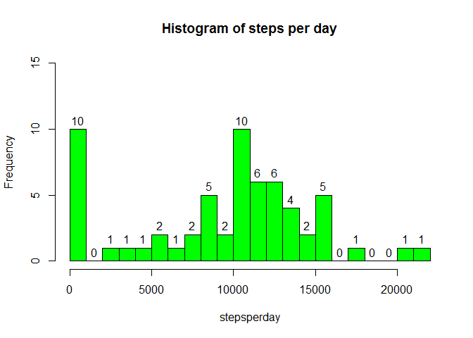
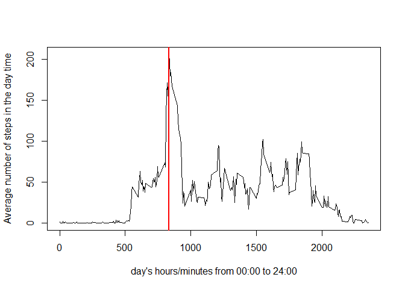
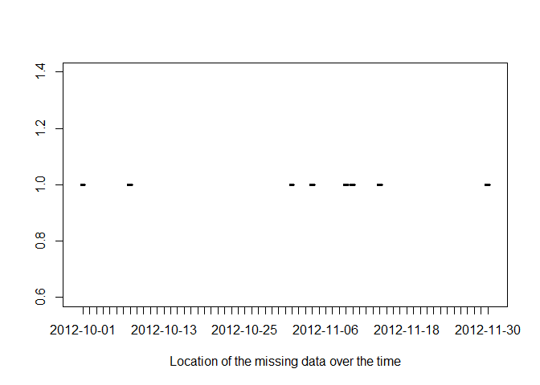
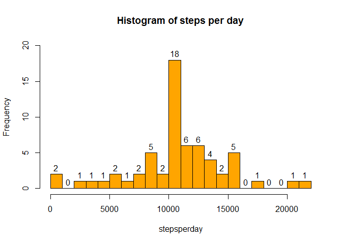
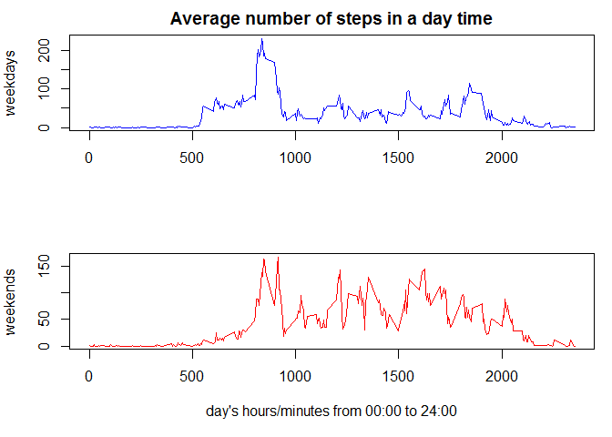

# Reproducible Research: Peer Assessment 1
opts_chunk$set(comment = "", error= TRUE, warning = FALSE, message = FALSE,
               tidy = TRUE, cache = F, echo = T,
               fig.width = 5, fig.height = 5)

## Loading and preprocessing the data

Let's assume that you downloaded the raw data in yout current directory.  

This can be done by 

- forking <https://github.com/rdpeng/RepData_PeerAssessment1>
- an then cloning your forked repo to you local directory


### checking the presence of the activity.zip file


```r
list.files()
```

```
##  [1] "activity.csv"                            
##  [2] "activity.zip"                            
##  [3] "doc"                                     
##  [4] "instructions_fig"                        
##  [5] "PA1_template.Rmd"                        
##  [6] "README.md"                               
##  [7] "Reproducible Research Assignment 1.Rmd"  
##  [8] "Reproducible_Research_Assignment_1.html" 
##  [9] "Reproducible_Research_Assignment_1.md"   
## [10] "Reproducible_Research_Assignment_1.Rmd"  
## [11] "Reproducible_Research_Assignment_1_files"
```

```r
unzip('activity.zip')
```

### loading and checking the raw data


```r
rdata <- read.csv('activity.csv',header=T)
str(rdata)
```

```
## 'data.frame':	17568 obs. of  3 variables:
##  $ steps   : int  NA NA NA NA NA NA NA NA NA NA ...
##  $ date    : Factor w/ 61 levels "2012-10-01","2012-10-02",..: 1 1 1 1 1 1 1 1 1 1 ...
##  $ interval: int  0 5 10 15 20 25 30 35 40 45 ...
```

```r
summary(rdata)
```

```
##      steps                date          interval     
##  Min.   :  0.00   2012-10-01:  288   Min.   :   0.0  
##  1st Qu.:  0.00   2012-10-02:  288   1st Qu.: 588.8  
##  Median :  0.00   2012-10-03:  288   Median :1177.5  
##  Mean   : 37.38   2012-10-04:  288   Mean   :1177.5  
##  3rd Qu.: 12.00   2012-10-05:  288   3rd Qu.:1766.2  
##  Max.   :806.00   2012-10-06:  288   Max.   :2355.0  
##  NA's   :2304     (Other)   :15840
```

```r
head(rdata)
```

```
##   steps       date interval
## 1    NA 2012-10-01        0
## 2    NA 2012-10-01        5
## 3    NA 2012-10-01       10
## 4    NA 2012-10-01       15
## 5    NA 2012-10-01       20
## 6    NA 2012-10-01       25
```

The data shows 61 days of 288 5 minutes sampling intervals (expressed in hours and minutes), giving **17568** observations

## What is mean total number of steps taken per day?

As there are **2304** missing values among the **17568** observations, let's ignore them first, *which will imply the number of steps per days with missing values to be zeroed*


```r
stepsperday <- tapply(rdata$steps,rdata$date,sum,na.rm=T)
hist(stepsperday, ylim=c(0,15),col = "green", breaks = 20, labels=T, main = 'Histogram of steps per day')
```

 

It can be noticed from the histogram that for instance there are 5 days for which the number of steps where comprised between 8000 and 9000.

The mean and median of the total number of steps per day is given by the summmary function

```r
summary(stepsperday)
```

```
##    Min. 1st Qu.  Median    Mean 3rd Qu.    Max. 
##       0    6778   10400    9354   12810   21190
```

## What is the average daily activity pattern?


```r
meanstepsperinterval <- tapply(rdata$steps,rdata$interval,mean,na.rm=T)
plot(levels(as.factor(rdata$interval)),meanstepsperinterval,type='l',
        xlab = 'day\'s hours/minutes from 00:00 to 24:00', ylab='Average number of steps in the day time')


## short interval transformation in hours and minutes
hour <- trunc(rdata$interval/100)
hour2 <- paste0('0',hour)
hour2 <- substr(hour2,nchar(hour2)-1,nchar(hour2))
minute <- rdata$interval-100*trunc(rdata$interval/100)
minute2 <-  paste0('0',minute)
minute2 <- substr(minute2,nchar(minute2)-1,nchar(minute2))
timeintervals <- paste0(hour2,':',minute2)

meanstepsperinterval[which(meanstepsperinterval == max(meanstepsperinterval))]
```

```
##      835 
## 206.1698
```

```r
abline(v=835,lwd=2,col='red')
```

 

The 5 minutes interval that contains the maximum number of steps is **08:35** am as shown above. It actually contains **206** steps.

## Imputing missing values
As explained above, there are **2304** missing values among the **17568** observations. In order to get more precise results, let's take them now into account.

The strategy depends on the NA locations in the dataset. Are some ponctual measurements missing or are entire days missing ? Let's investigate.


```r
misdata <- rdata[which(is.na(rdata)),1:3]
misdata[,1]=1
plot(misdata$date,misdata$steps, xlab='Location of the missing data over the time')
```

 

The missing values seem to be concentrated. We need to zoom out.


```r
whereareNAs <- table(misdata$date)
which(whereareNAs != 0)
```

```
## 2012-10-01 2012-10-08 2012-11-01 2012-11-04 2012-11-09 2012-11-10 
##          1          8         32         35         40         41 
## 2012-11-14 2012-11-30 
##         45         61
```

```r
whereareNAs[whereareNAs != 0]
```

```
## 
## 2012-10-01 2012-10-08 2012-11-01 2012-11-04 2012-11-09 2012-11-10 
##        288        288        288        288        288        288 
## 2012-11-14 2012-11-30 
##        288        288
```

**Entire days are missing** so no extrapolation with the mean of 2 successive values is possible.

Instead wi will replace the missing days by the mean number of steps of the other days, for every 5 minutes intervals.


```r
for (i in 1:length(rdata$steps)) if (is.na(rdata$steps[i])) rdata$steps[i] <- meanstepsperinterval[1 + (i-1)%%288]
```

... and check what changes:


```r
str(rdata)
```

```
## 'data.frame':	17568 obs. of  3 variables:
##  $ steps   : num  1.717 0.3396 0.1321 0.1509 0.0755 ...
##  $ date    : Factor w/ 61 levels "2012-10-01","2012-10-02",..: 1 1 1 1 1 1 1 1 1 1 ...
##  $ interval: int  0 5 10 15 20 25 30 35 40 45 ...
```

```r
summary(rdata)
```

```
##      steps                date          interval     
##  Min.   :  0.00   2012-10-01:  288   Min.   :   0.0  
##  1st Qu.:  0.00   2012-10-02:  288   1st Qu.: 588.8  
##  Median :  0.00   2012-10-03:  288   Median :1177.5  
##  Mean   : 37.38   2012-10-04:  288   Mean   :1177.5  
##  3rd Qu.: 27.00   2012-10-05:  288   3rd Qu.:1766.2  
##  Max.   :806.00   2012-10-06:  288   Max.   :2355.0  
##                   (Other)   :15840
```

```r
head(rdata)
```

```
##       steps       date interval
## 1 1.7169811 2012-10-01        0
## 2 0.3396226 2012-10-01        5
## 3 0.1320755 2012-10-01       10
## 4 0.1509434 2012-10-01       15
## 5 0.0754717 2012-10-01       20
## 6 2.0943396 2012-10-01       25
```

```r
stepsperday <- tapply(rdata$steps,rdata$date,sum)
hist(stepsperday, ylim=c(0,20),col = "orange", breaks = 20, labels=T, main = 'Histogram of steps per day')
```

 

```r
summary(stepsperday)
```

```
##    Min. 1st Qu.  Median    Mean 3rd Qu.    Max. 
##      41    9819   10770   10770   12810   21190
```

We can notice the following:

- There are no more NAs for the number of steps
- The minimum value for the steps per days is now different from 0
- The plot clearly shows that the total number of days having between 0 an 1000 steps has been reduced conseuently and shifted to the [10 000 , 11 000] interval where the mean stands
- The mean and median values are the same, which was not the case when ignoring the missing values
- The maximum value for the steps per days remains unchanged as expected


## Are there differences in activity patterns between weekdays and weekends?


```r
weekday <-c('Monday','Tuesday','Wednesday','Thursday','Friday')
weekend <-c('Saturday','Sunday')

## create a new factor in the dataset according to weekdays or weekends
rdata$day <- weekdays(strptime(rdata$date,'%Y-%m-%d'))
for (i in 1:length(rdata$steps)) if (rdata$day[i] %in% weekday) rdata$day[i] <-'weekday' else rdata$day[i]<-'weekend'
rdata$day <- as.factor(rdata$day)

# split the data in 2 different sets for weekdays and weekends and compute the average number of steps in each case
weekdaydata <- rdata[which(rdata$day== 'weekday'),]
weekenddata <- rdata[which(rdata$day== 'weekend'),]
weekdaymeansteps <- tapply(weekdaydata$steps,weekdaydata$interval,mean)
weekendmeansteps <- tapply(weekenddata$steps,weekenddata$interval,mean)

par(mfrow = c(2, 1), mar = c(5, 4, 2, 1))
plot(levels(as.factor(weekdaydata$interval)),weekdaymeansteps,type='l', col = 'blue',
        main = 'Average number of steps in a day time',xlab='',ylab='weekdays')
plot(levels(as.factor(weekenddata$interval)),weekendmeansteps,type='l', col = 'red',
        xlab = 'day\'s hours/minutes from 00:00 to 24:00', ylab='weekends')
```

 

It can be seen that the peak average number of steps is higher at weekdays, but the average number of steps is more important at weekends.
